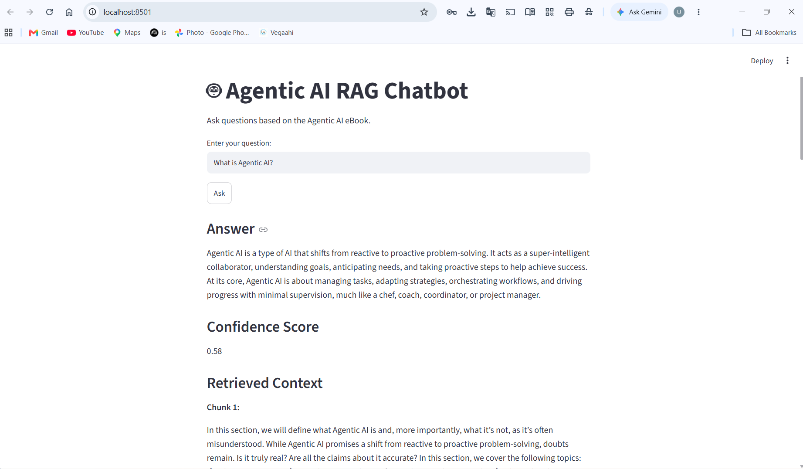
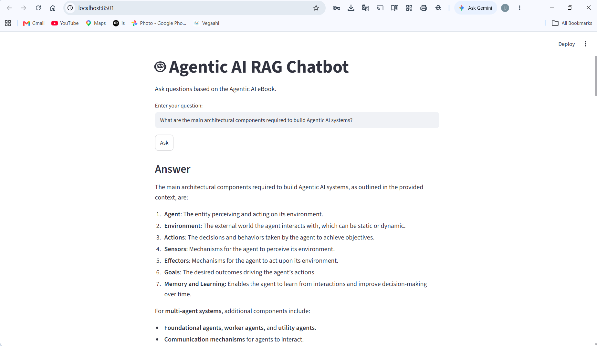
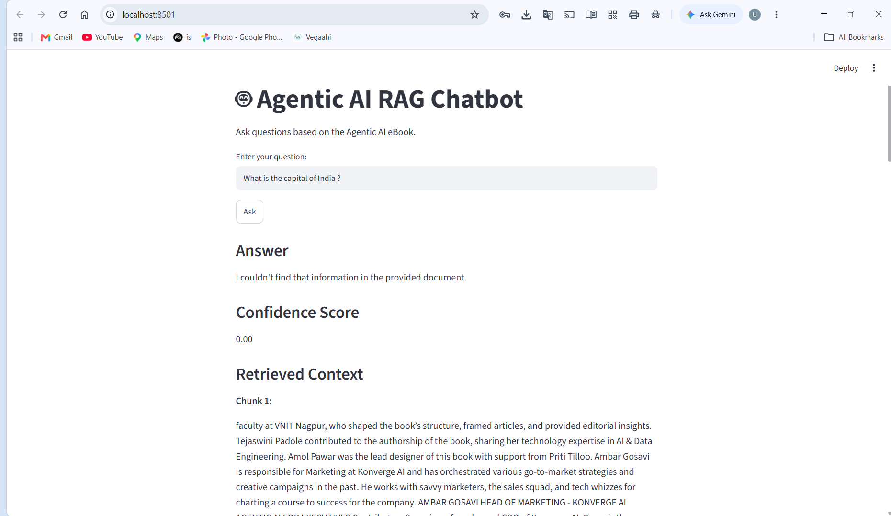

# 🤖 Agentic AI RAG Chatbot

A Retrieval-Augmented Generation (RAG) chatbot built using **LangGraph, Cohere, Pinecone, LangChain, and Streamlit**.

## Project Overview

This project implements a document-grounded RAG chatbot that answers questions strictly based on the provided **Agentic AI eBook PDF**.

The system performs the following steps:

1. Loads and parses the PDF document.
2. Splits the document into smaller overlapping chunks.
3. Generates vector embeddings using Cohere.
4. Stores the embeddings and document metadata in Pinecone.
5. Retrieves the most relevant document chunks for a user query.
6. Uses LangGraph to orchestrate the RAG workflow.
7. Generates a grounded answer using Cohere.
8. Returns the answer along with retrieved context and a confidence score.
9. Provides an interactive Streamlit web interface.

## Technologies Used

- Python
- LangChain
- LangGraph
- Cohere
- Pinecone
- Streamlit
- PyPDF
- Python-dotenv

## Model Provider

The assignment specification mentions OpenAI Embeddings and an OpenAI-based LLM. During implementation, the available OpenAI API access was limited due to account/credit restrictions.

Therefore, **Cohere** was used as an alternative model provider:

- **Cohere `embed-v4.0`** for document and query embeddings
- **Cohere `command-a-03-2025`** for grounded response generation
- **Pinecone** remains the vector database
- **LangGraph** remains the orchestration framework

This change does not alter the core RAG architecture or workflow. The system still performs document ingestion, chunking, vector embedding, Pinecone similarity retrieval, LangGraph orchestration, and context-grounded answer generation.

## RAG Workflow

```text
PDF Document
     ↓
PDF Parsing
     ↓
Text Chunking
     ↓
Cohere Embeddings
     ↓
Pinecone Vector Database
     ↓
Similarity Search
     ↓
LangGraph Retrieve Node
     ↓
LangGraph Generate Node
     ↓
Cohere LLM
     ↓
Grounded Answer
```

## Response Structure

The application returns a structured response containing the user's query, generated answer, retrieved document chunks, and a confidence score.

```json
{
  "query": "What is Agentic AI?",
  "final_answer": "Agentic AI refers to ...",
  "retrieved_context_chunks": [
    "Retrieved chunk 1...",
    "Retrieved chunk 2...",
    "Retrieved chunk 3...",
    "Retrieved chunk 4..."
  ],
  "confidence_score": 0.92
}
```

## Groundedness

The chatbot is instructed to answer questions using **only the retrieved context from the Agentic AI eBook**.

If the requested information cannot be found in the provided document, the chatbot responds:

```text
I couldn't find that information in the provided document.
```

For out-of-scope questions, the confidence score is set to `0.0`.

The confidence score represents an **approximate retrieval similarity confidence** calculated from the retrieved Pinecone similarity results. It is intended as an indication of retrieval relevance rather than a guaranteed measure of answer correctness.

## Setup

### 1. Clone the Repository

```bash
git clone https://github.com/udaysai-17/RAG-Chatbot-Assignment.git
cd RAG-Chatbot-Assignment
```

### 2. Create a Virtual Environment

```bash
py -m venv venv
```

Activate the virtual environment on Windows:

```bash
venv\Scripts\activate
```

### 3. Install Dependencies

```bash
pip install -r requirements.txt
```

### 4. Configure Environment Variables

Create a `.env` file in the project root:

```env
COHERE_API_KEY=
PINECONE_API_KEY=
PINECONE_INDEX_NAME=agentic-ai-index
```

Do not commit the `.env` file to GitHub.

### 5. Ingest the PDF

Run the ingestion pipeline:

```bash
python -m src.ingestion
```

The ingestion process:

- Loads the Agentic AI eBook.
- Splits the document into chunks.
- Generates Cohere embeddings.
- Stores the vectors in Pinecone.
- Preserves document metadata such as page and source information.

### 6. Run the Chatbot

Start the Streamlit application:

```bash
streamlit run app.py
```

Open the application in your browser:

```text
http://localhost:8501
```

## Project Structure

```text
RAG-Chatbot-Assignment/
│
├── data/
│   └── Ebook-Agentic-AI.pdf
│
├── src/
│   ├── __init__.py
│   ├── config.py
│   ├── graph.py
│   └── ingestion.py
│
├── app.py
├── test_graph.py
├── test_sample_queries.py
├── requirements.txt
├── .env.example
├── .gitignore
└── README.md
```

## LangGraph Architecture

The LangGraph workflow contains two primary nodes:

### Retrieve Node

The Retrieve Node:

- Receives the user's question.
- Performs semantic similarity search against Pinecone.
- Retrieves the top relevant document chunks.
- Builds the context used by the generation node.
- Calculates an approximate retrieval confidence score.

### Generate Node

The Generate Node:

- Receives the user question and retrieved context.
- Uses Cohere to generate the answer.
- Restricts generation to the provided document context.
- Returns a grounded response.
- Sets the confidence score to `0.0` when the requested information is not available in the document.

## Features

- PDF-based question answering
- Retrieval-Augmented Generation
- Semantic similarity search
- Pinecone vector database
- Cohere embeddings
- Cohere LLM generation
- LangGraph orchestration
- Context-grounded responses
- Approximate retrieval confidence scoring
- Structured JSON response
- Streamlit web interface
- Out-of-scope question handling
- Prevention of unsupported answers

## Example

### In-Scope Question

```text
What is Agentic AI?
```

The system retrieves relevant sections from the Agentic AI eBook and generates an answer based on the retrieved context.

### Out-of-Scope Question

```text
What is the capital of India?
```

If the information is not available in the provided document, the chatbot responds:

```text
I couldn't find that information in the provided document.
```

The confidence score is:

```text
0.00
```

## Testing

The LangGraph pipeline can be tested using:

```bash
python test_graph.py
```

The application was tested using:

- Relevant questions from the Agentic AI eBook
- Questions about Agentic AI concepts
- Out-of-scope questions
- Structured response validation

The out-of-scope test verifies that the chatbot does not use external knowledge when the requested information is not present in the provided document.

## Sample Validation Queries

The following questions can be used to validate the chatbot:

```text
What is the core definition of Agentic AI?
```

```text
What are the main architectural components required to build agentic systems?
```

```text
What real-world industry use cases for Agentic AI are discussed in the eBook?
```

```text
How does Agentic AI differ from traditional generative AI chatbots according to the text?
```

```text
What key challenges or limitations of Agentic AI are mentioned in the document?
```

```text
What is the capital of India?
```

The final question is an out-of-scope test and should not be answered using external knowledge.

## Sample Results

The RAG chatbot was tested with both in-scope and out-of-scope questions.

### 1. Agentic AI Query

**Query:** What is Agentic AI?

The system retrieves relevant document chunks from the Agentic AI eBook and generates a context-grounded answer.



### 2. Architecture Query

**Query:** What are the main architectural components required to build Agentic AI systems?

The system retrieves relevant sections from the document and generates an answer based on the retrieved context.



### 3. Out-of-Scope Query

**Query:** What is the capital of India?

The chatbot does not use external knowledge when the requested information is not found in the provided document.

It returns:

I couldn't find that information in the provided document.

The confidence score is 0.00.




## Assignment Requirements Coverage

| Requirement | Implementation |
|---|---|
| PDF ingestion | PyPDF |
| Text chunking | RecursiveCharacterTextSplitter |
| Vector embeddings | Cohere `embed-v4.0` |
| Vector database | Pinecone |
| Retrieval | Pinecone similarity search |
| Orchestration | LangGraph |
| Response generation | Cohere `command-a-03-2025` |
| Grounded responses | Context-only generation |
| Confidence score | Retrieval similarity-based score |
| Structured response | JSON payload |
| User interface | Streamlit |
| Documentation | README.md |

## Security

API keys are stored in environment variables using `.env`.

The `.env` file is excluded from version control through `.gitignore`.

Never commit API keys or other credentials to the public repository.


